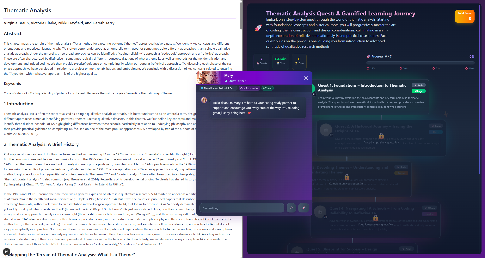

# GamifiedLM

**Co-Designing an LLM-Driven Gamified Learning App with University Students to Mitigate Learning Difficulties**

Kaiyuan Tang¹, Kerui Chen¹, Shreya Gopi², Li Xie², Mark Quinlan¹, Youngjun Cho¹
¹ *University College London*  ·  ² *Nanyang Technological University*

ACM DIS '26 · [10.1145/3800645.3812916](https://doi.org/10.1145/3800645.3812916)

---

> **Note on this release.** This repository contains the **alpha version** of the GamifiedLM demo described in our DIS '26 paper. The lead author is actively exploring the possibility of evolving GamifiedLM into a polished product, and therefore subsequent iterations — including refined prompts, fine-tuned models, and production-grade features — will not be made public here. We thank you for your understanding, and we hope the architecture and ideas in this repository can offer useful inspiration for related research and projects.

---



## Abstract

Large language models (LLMs) have become popular learning aids, yet research into their truly beneficial uses remains in its early stages. This paper presents the design, development, and evaluation of an LLM-driven gamified learning prototype, **GamifiedLM**, which explores the novel integration of LLMs with gamified learning theories. Unlike the most prevalent chat-based LLM apps, GamifiedLM integrates multi-agent systems and generative user interface (UI) technologies, rendering the output of LLMs into a richer, interactive learning flow. Through two co-design sessions with 10 UK university students experiencing mild learning difficulties and a subsequent mixed-methods evaluation, we found that GamifiedLM can better maintain learners' motivation and focus, and support more effective mastery of reading materials, compared to existing tools. This work contributes to exploring how LLMs can be designed in line with beneficial learning theories and accessible educational practices.

## Core Components

GamifiedLM transforms lengthy reading tasks into a gamified, interactive learning flow built around four components:

1. **Learning Roadmap** — segments and plans extended learning tasks into progressive quests.
2. **Personalisable AI Companion** — a customisable character that provides context-aware dialogue and companionship.
3. **In-Step Highlights & Narratives** — generative content that reframes source material as engaging stories.
4. **Challenges & Incentives** — adaptive exercises and motivational rewards during progress checks.

## Tech Stack

- **Framework:** Next.js 15 · React 19 · TypeScript
- **LLM:** OpenAI via the [Vercel AI SDK](https://sdk.vercel.ai/) (multi-agent orchestration, structured output with Zod, streaming generative UI)
- **Styling:** Tailwind CSS

## Getting Started

```bash
npm install
echo "OPENAI_API_KEY=sk-..." > .env.local
npm run dev
```

Then open [http://localhost:3000](http://localhost:3000).

## Keywords

Generative Artificial Intelligence (GenAI) · Large Language Models (LLMs) · Gamified Learning · Generative UI · Multi-agent System · Co-design

## Citation

```bibtex
@inproceedings{tang2026gamifiedlm,
  title     = {GamifiedLM: Co-Designing an LLM-Driven Gamified Learning App with University Students to Mitigate Learning Difficulties},
  author    = {Tang, Kaiyuan and Chen, Kerui and Gopi, Shreya and Xie, Li and Quinlan, Mark and Cho, Youngjun},
  booktitle = {Designing Interactive Systems Conference (DIS '26)},
  year      = {2026},
  address   = {Singapore, Singapore},
  publisher = {ACM},
  doi       = {10.1145/3800645.3812916}
}
```

## License

The source code in this repository is released under [CC BY 4.0](https://creativecommons.org/licenses/by/4.0/), consistent with the paper's open-access license.
